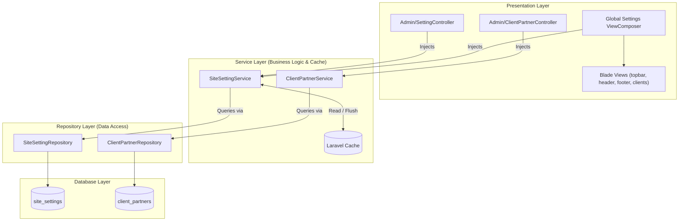

# Rencana Implementasi: Konten Dinamis Halaman Home (Pola Arsitektur Service-Repository)

> **For agentic workers:** REQUIRED SUB-SKILL: Use superpowers:subagent-driven-development to implement this plan task-by-task. Steps use checkbox (`- [ ]`) syntax for tracking.

**Goal:** Mengubah data statis pada halaman Home (kontak, media sosial, alamat workshop, dan daftar klien/mitra instansi) menjadi dinamis berbasis database dengan antarmuka manajemen di Dashboard Admin menggunakan pola **Service-Repository**.

**Architecture:**
Mengikuti konvensi yang sudah ada pada `StationController` -> `StationService` -> `StationRepository`:

1. **Repository Layer** (`app/Repositories/`): Bertanggung jawab murni untuk query database Eloquent (`SiteSettingRepository`, `ClientPartnerRepository`).
2. **Service Layer** (`app/Services/`): Berisi business logic, auto-caching (Cache remember & flush), manipulasi data, dan upload file logo (`SiteSettingService`, `ClientPartnerService`).
3. **Controller Layer** (`app/Http/Controllers/`): Ramping (_thin controller_), hanya menerima HTTP Request, memanggil Service via constructor injection, dan me-return View atau Redirect response (`SettingController`, `ClientPartnerController`).
4. **Provider Layer** (`app/Providers/`): Meregistrasikan View Composer untuk menyediakan pengaturan ke view secara otomatis (`AppServiceProvider`).

**Architecture Diagram:**

**Tech Stack:**

- Laravel 11 / 12 (Eloquent, Repository-Service Pattern, View Composers, Cache)
- Admin UI: Bootstrap 5 (Zanex Admin Theme)
- Frontend: Tailwind CSS v4 (Higertech Portal)
- Testing: PHPUnit / Pest Feature Tests

## Global Constraints

- **Pola Arsitektur**: Dilarang melakukan query Eloquent langsung di Controller. Semua akses data harus melalui Repository dan Service.
- **Dependency Injection**: Menggunakan constructor property promotion (`private readonly ...`).
- **Caching**: Semua `site_settings` di-cache; cache di-flush saat setting diubah.
- **Fallback Safety**: Jika database kosong, helper `setting($key, $default)` selalu mengembalikan nilai default.

---

### Task 1: Database Migrations, Seeders & Models (`SiteSetting` & `ClientPartner`)

**Files:**

- Create: `database/migrations/2026_09_16_000001_create_site_settings_table.php`
- Create: `database/migrations/2026_09_16_000002_create_client_partners_table.php`
- Create: `app/Models/SiteSetting.php`
- Create: `app/Models/ClientPartner.php`
- Create: `database/seeders/SiteSettingSeeder.php`
- Create: `database/seeders/ClientPartnerSeeder.php`
- Test: `tests/Feature/SiteSettingModelTest.php`

**Interfaces:**

- Consumes: Database connection
- Produces: `SiteSetting` model, `ClientPartner` model, seed data

- [ ] **Step 1: Buat migration dan model `SiteSetting`**
      Kolom: `id`, `key` (unique), `value` (text nullable), `group` (string, index), `type` (string: text, textarea, url, image), `timestamps`.
- [ ] **Step 2: Buat migration dan model `ClientPartner`**
      Kolom: `id`, `name`, `sub` (kementerian/dinas), `abbr`, `color` (badge style), `logo` (nullable), `order` (integer default 0), `is_active` (boolean default true), `timestamps`.
- [ ] **Step 3: Buat seeder dengan data statis yang saat ini ada di `footer.blade.php` dan `clients.blade.php`**
- [ ] **Step 4: Jalankan migration & seeder, verifikasi data terisi**

---

### Task 2: Repositories (`SiteSettingRepository` & `ClientPartnerRepository`)

**Files:**

- Create: `app/Repositories/SiteSettingRepository.php`
- Create: `app/Repositories/ClientPartnerRepository.php`
- Test: `tests/Unit/SiteSettingRepositoryTest.php`

**Interfaces:**

- Consumes: `SiteSetting`, `ClientPartner` models
- Produces: Data access methods (`getAllGrouped()`, `findByKey()`, `updateOrCreate()`, `getActiveClients()`, `save()`, `delete()`)

- [ ] **Step 1: Implementasi `SiteSettingRepository`**
      Method: `all()`, `getByGroup(string $group)`, `findByKey(string $key)`, `set(string $key, ?string $value, string $group = 'general', string $type = 'text')`.
- [ ] **Step 2: Implementasi `ClientPartnerRepository`**
      Method: `getActive()`, `all()`, `findById(int $id)`, `create(array $data)`, `update(int $id, array $data)`, `delete(int $id)`.
- [ ] **Step 3: Tulis unit test untuk verifikasi operasi query repository**

---

### Task 3: Services & Global View Composer (`SiteSettingService` & `ClientPartnerService`)

**Files:**

- Create: `app/Services/SiteSettingService.php`
- Create: `app/Services/ClientPartnerService.php`
- Create: `app/Helpers/setting.php` (global helper `setting($key, $default)`)
- Modify: `app/Providers/AppServiceProvider.php` (registrasi View Composer)
- Modify: `composer.json` (autoload helper jika diperlukan)
- Test: `tests/Feature/SiteSettingServiceTest.php`

**Interfaces:**

- Consumes: `SiteSettingRepository`, `ClientPartnerRepository`, Laravel `Cache`
- Produces: `SiteSettingService`, `ClientPartnerService`, helper function `setting()`, variable global di view

- [ ] **Step 1: Implementasi `SiteSettingService`**
      Inject `SiteSettingRepository`. Caching dengan key `site_settings.all`. Method `get($key, $default)`, `updateMany(array $settings)`, `flushCache()`.
- [ ] **Step 2: Implementasi `ClientPartnerService`**
      Inject `ClientPartnerRepository`. Method `getActiveClients()`, `store(array $data)`, `update(int $id, array $data)`, `delete(int $id)`.
- [ ] **Step 3: Registrasi helper `setting()` dan View Composer di `AppServiceProvider`**
- [ ] **Step 4: Tulis feature test untuk menguji integrasi cache dan fallback value**

---

### Task 4: Admin UI & Controllers (`SettingController` & `ClientPartnerController`)

**Files:**

- Create: `app/Http/Controllers/Admin/SettingController.php`
- Create: `app/Http/Controllers/Admin/ClientPartnerController.php`
- Create: `resources/views/admin/settings/index.blade.php`
- Create: `resources/views/admin/clients/index.blade.php`
- Create: `resources/views/admin/clients/form.blade.php`
- Modify: `routes/web.php` (Tambahkan rute admin yang diproteksi)
- Modify: `resources/views/admin/components/sidebar.blade.php` (Tambahkan menu di sidebar admin)

**Interfaces:**

- Consumes: `SiteSettingService`, `ClientPartnerService` (via constructor injection)
- Produces: Thin Controllers, Blade views bertema Zanex Bootstrap

- [ ] **Step 1: Implementasi `SettingController`**
      Inject `SiteSettingService`. Method: `index()`, `update(Request $request)`.
- [ ] **Step 2: Implementasi `ClientPartnerController`**
      Inject `ClientPartnerService`. Method: `index()`, `create()`, `store()`, `edit()`, `update()`, `destroy()`.
- [ ] **Step 3: Buat view `admin/settings/index.blade.php` (Tab Kontak, Tab Media Sosial, Tab Alamat & Kantor)**
- [ ] **Step 4: Buat view `admin/clients/index.blade.php` & `form.blade.php` (Daftar mitra klien & form tambah/edit)**
- [ ] **Step 5: Daftarkan rute di `routes/web.php` dan link menu di `sidebar.blade.php`**

---

### Task 5: Integrasi Frontend Halaman Home

**Files:**

- Modify: `resources/views/landing/partials/topbar.blade.php`
- Modify: `resources/views/landing/partials/header.blade.php`
- Modify: `resources/views/landing/partials/footer.blade.php`
- Modify: `resources/views/landing/partials/clients.blade.php`

**Interfaces:**

- Consumes: Helper `setting()`, data `$clients` via `ClientPartnerService`
- Produces: Landing page yang sepenuhnya dinamis terhubung ke database

- [ ] **Step 1: Hubungkan `topbar.blade.php` & `header.blade.php` menggunakan helper `setting('contact_email')`, `setting('contact_phone')`**
- [ ] **Step 2: Hubungkan `footer.blade.php` menggunakan helper `setting('contact_address')`, `setting('social_whatsapp')`, `setting('social_linkedin')`, `setting('social_instagram')`, `setting('social_youtube')`**
- [ ] **Step 3: Hubungkan `clients.blade.php` dengan data dari `ClientPartnerService::getActiveClients()`**
- [ ] **Step 4: Uji tampilan di browser (Light & Dark Mode) dan pastikan 100% responsif tanpa error**

---

## Verification Plan

### Automated Tests

- `php artisan test --filter=SiteSetting`
- `php artisan test --filter=ClientPartner`

### Manual Verification

1. Login ke `/login` dan buka `/admin/settings`.
2. Ubah data kontak (telepon, email, WhatsApp) di dashboard admin, lalu tekan Simpan.
3. Buka halaman utama `/` (Home), periksa apakah email & nomor telepon di topbar dan footer langsung terupdate.
4. Masuk ke `/admin/clients`, buat data mitra baru (misal: "BBWS Citarum"), buka section Klien di Home untuk memastikan kartu baru langsung muncul.
